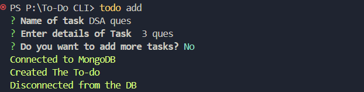
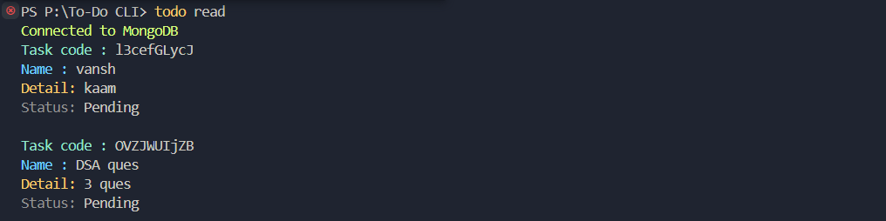
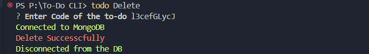
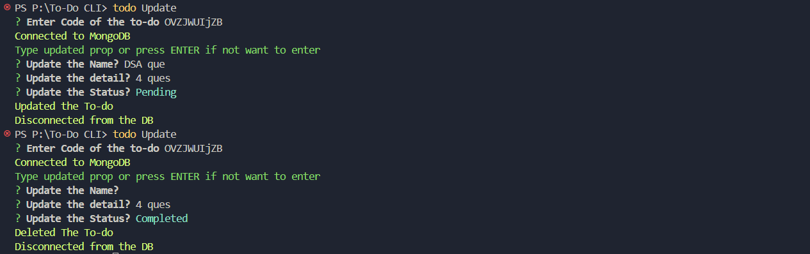

<h1>To-do in CLI Remotely Accessable </h1>
<h3> How to Use It </h3>
<h4> Change the name of .env.sample to .env and paste your connection string Of Mongo Atlas DB (For Using it on local paste mongo Compass) </h4>
Firstly, you need to install Node.js and npm on your computer.

After Cloning it - 
on terminal/command prompt navigate to the cloned folder  using `cd` command 

Then Type this command to install all dependencies- 
npm -i -g

then do type after installing - 

node index.js

then Ready to go -

just open Terminal  or Command Prompt and type what you want to do .

After writing todo 
Type 'add' for adding a task and follow on
Options:
  -V, --version   output the version number
  -h, --help      display help for command

Commands:
  add             Add  a task to the list
  read            Read  a task to the list
  Delete          Delete a task
  Update          Update a task to the list
  help [command]  display help for command

